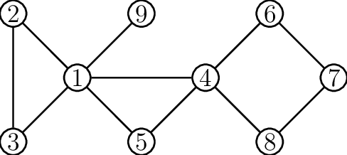
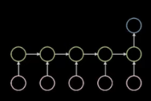
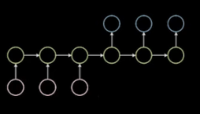

# LAZY-TS for graph diffusion
## Table of content
<!-- vscode-markdown-toc -->
* 1. [ Introduction](#Introduction)
* 2. [ Time Series](#TimeSeries)
* 3. [Dataset](#Dataset)
* 4. [Graph Neural Networks (GNNs) and Diffusion Models Introduction](#GraphNeuralNetworksGNNsandDiffusionModelsIntroduction)
	* 4.1. [Projection](#Projection)
	* 4.2. [Models](#Models)
		* 4.2.1. [GCN](#GCN)
		* 4.2.2. [GAT-LSTM](#GAT-LSTM)
* 5. [ TO-DO](#TO-DO)

<!-- vscode-markdown-toc-config
	numbering=true
	autoSave=true
	/vscode-markdown-toc-config -->
<!-- /vscode-markdown-toc -->

##  1. <a name='Introduction'></a> Introduction 
Welcome to this repository! 

This project of mine is centered on exploring the expressivity Graph Neural Networks (GNNs) and their connection with diffusion models on graphs. The goal of this repo is to create a unique library for multi-dimensional (or unidimensional) timeseries regression on static graph. Up to now the model that have been implemented are 
* GLSTM one shot prediction
* GLSTM seq2seq prediction
* GCN_LSTM
* GAT-LSTM one shot prediction
* GAT-LSTM seq2seq

Future release will have
* GCLSTM seq2seq prediction
* ARIMA
* ARMA

Once a certain dataset is given and all the models have been executed, the ranking list is shown.

The order is given by the loss function defined at the begining because is the one that is shared among all the models. This is important to say because there can be models that require additional terms to the loss in order to work, like KL divergence for the VAE model.

Here there is shown a toy example of how the ranking list could be:

|model|score|
|----|----|
|GLSTMseq2seq|2210.542999267578|
|GAT_LSTMseq2seq|2347.313934326172|
|GLSTM|5316.68505859375|
|GAT_LSTM|5443.055419921875|
|GCN_LSTM|5471.723876953125|

Moreover, once everything has been computed, the best model is used for plotting the whole time series with a comparison between real and approximation values:


##  2. <a name='TimeSeries'></a> Time Series 

**Definition [Time Series]**  
A multivariate timeseries is a finite part of a realization from a stochastic process $`\{X_t,t\in T\}\subset\mathbb{R}^k`$.


As it was said in the definition $X_t\in \mathbb{R}^k$ but it is a result of a concatenation of 2 types of variables:

1. $\mathcal{C} \subset \mathbf{N}^c$ the set of categorical variables.
2. $\mathcal{W} \subset \mathbf{R}^{k-c}$ the set of numerical variables

For this reason it is possible to write $\forall t\in T_0, 
X_t = (c_t|w_t)$ where $c_t\in\mathcal{C}, w_t\in \mathcal{W}$.

***   
**Important**  
For simplicity, it is assumed that the categorical variables are always known, i.e. $`\{w_t\}_{t\in T}`$ is a predictable process.  
***   
Since this library talks about graph it is important to give a formal definition of graph.

**Definition [Graph]**   
A graph is a pair $G = (V, E)$, where $V$ is the set of the elements of the graph and $E$ is a set of edges, i.e. let $v,u\in V$ then if $v$ is connected with $u$ then $(v,u)\in E$. Moreover, let $u\in V$, the set of neighbours of $u$ is defined as
```math
N(u):=\{v\in V|(u,v)\in E\}
```
Here it is possible to see an example of graph



The graph it is said to be **static** if the adjacency do not vary in time.

##  3. <a name='Dataset'></a>Dataset
Now it is possible to describes how a dataset is defined and so how is the input of a model.  
As it was said at the beginning $x_t$ is a concatenation of numerical an categorical variables. Thus if $x_t\in \mathbb{R}^k$ then the first $m$ variables are those reffering to numerical variables while the last $k-m$ are referring to the categorical variables.  

Given a dataset `df` the important variables for creating the dataset are:
* `past_step` : number of step to look in the past.
* `future_step`: number of step to look in the future.
* `past_variable`: a list of all the variables that need to be taken from the dataset corresponding to the past
* `future_variable`: a list of all the variables that need to be taken from the dataset corresponding to the past
* `y`: list of numerical variables that need to be predicted
* `adj`: the adjacency matrix of the graph.
* `nodes`: number of nodes of the graph

```
class dataset(Dataset):
    
    def __init__(self, 
                 df: pandas.Dataframe,
                 past_step:int, 
                 future_step:int, 
                 past_variables: list,
                 future_variables: list, 
                 y:list,
                 adj: np.array,
                 nodes: int, 
                 timedelta:str = 'D',
                 col_data: str = "data"):
        self.x = []
        self.y = []
        self.adj = adj
        self.past_step = past_step
        self.future_step = future_step
```
Let $G=(V,E)$ the graph that needs to be studied and $p$ be the past steps and $m$ the future steps. $\forall t\in T$, the input of the models is composed of 
* **the past information**: a 3D-tensor (4D-tensor if it is consider the batch input), where $\forall k\in [0, \cdots, p-1]$
```math
\mathbb{X}_{t-k}^p=\begin{bmatrix}X_{t-k,1}\\ \vdots\\ X_{t-k,|V|}\end{bmatrix}
```
* **the future information** (the predictable process): a 3D-tensor where $\forall k\in [1, \cdots, f]$
```math
\mathbb{X}_{t-k}^f=\begin{bmatrix}X_{t+k,1}\\ \vdots\\X_{t+k,|V|}\end{bmatrix}
```
Clearly the dimensionality of the features in each node in the future is less or equal the the dimensionality in the past.
* **Adjacency** : the adjacency matrix that describes the connection among the graph. Here below there is an example of adjacency matrix referring to the previous graph:
```math 
A = \begin{bmatrix}0&1&1&1&1&0&0&0&1\\
1&0&1&0&0&0&0&0&0\\
1&1&0&0&0&0&0&0&0\\
1&0&0&0&1&1&0&1&0\\
1&0&0&1&0&0&0&0&0\\
0&0&0&1&0&0&1&0&0\\
0&0&0&0&0&1&0&1&0\\
0&0&0&1&0&0&1&0&0\\
1&0&0&0&0&0&0&0&0
\end{bmatrix}
```

Operatively speaking the Dataset class will produce for every `idx`
 the following 
 ```
 xp, xf, adj, y = next(iter(Dataset))
 ```
____

##  4. <a name='GraphNeuralNetworksGNNsandDiffusionModelsIntroduction'></a>Graph Neural Networks (GNNs) and Diffusion Models Introduction

Every model is composed of 3 main part:
1. _Pre-Processing of the input_  
   Since every vector associated with a node has categorical variables first it is necessary to embbed them and then process the whole input with a simple feed forward neural network.
2. _Embedding of the graph_   
   In this part, for all the steps the whole graph is embedded using a Graph neural network. This part will be better explained in the `Models` part.
3. _Projection_   
   This part takes all the embedded features and then create a projection in the future of size $|y|\times|V|\times m$


###  4.1. <a name='Projection'></a>Projection
Before talking about the inner model. It is usefull to talk about how the model forecast the values. There are 2 main approaches:
* _Sequence to vector_   
  The embedding of the graph on the past is sequenced with a model (LSTM, RNN...) and then the last values is decoded to produce the desired output. Here below there is a graphic representation of what it has been said here

     
* _Sequence to sequence_   
  The embedding of the graph on the past is sequenced with a model (LSTM, RNN...) and then the last value is passed to another model that use the future information to produce similarly as before a forecasting. Here below there is a graphic representation of what it has been said here

     

**Observation**  
It is not possible to stack all the vectors into one and then do a forecasting because the size of the graph can change over times. This condition do not violate the assumption of `static graph` because changing the size of a graph do not imply that the adjacency vary over time.

###  4.2. <a name='Models'></a>Models
In this part it will be described the models that have been implemented for embedding the information of the graph in each time-step.

####  4.2.1. <a name='GCN'></a>GCN
The Graph Convolutional neural network use the augmented laplacian in order to do the convolution 
Let $G=(V, E)$ be a graph and denote $D, A$ respectively the degree and the adjacency matrix of $G$. Then the augmented Laplacian matrix is 
```math
\tilde{L}=\tilde{D}^{-\frac{1}{2}}L\tilde{D}^{-\frac{1}{2}}= I-\tilde{D}^{-\frac{1}{2}}\tilde{A}\tilde{D}^{-\frac{1}{2}}
```
####  4.2.2. <a name='GAT-LSTM'></a>GAT-LSTM
This architecture is based on the concept of GAT (Graph attention network) for embedding the features of the nodes and then using an LSTM for generating the stream of data.

The concept of GAT architecture is taken from this [paper](https://arxiv.org/abs/1710.10903).

Let $G=(V,E)$ be a graph and $i\in V$. The set of neighbour of $i$ is defined by $N(i)$.  This is important since the main point of the GAT's architecture is 
```math
\alpha_{i,j}=\left\{\begin{aligned}
&\frac{\exp(\langle a, W h_i||W h_j\rangle)}{\sum_{j\in N(i)}\exp(\langle a, W h_i||W h_j\rangle)}&& j\in N(i)\\
&\alpha_{i,j}=0 && j\notin N(i)
\end{aligned}\right.
```
Since it is very expensive to concatenate two vectors. Thus let $a=(a_1||a_2)$ then
```math
z_{i,j}:=\langle a, v_i||v_j\rangle = \langle a_1, v_i\rangle  +\langle a_2, v_j\rangle  
```
so if $n=|V|$ then
```math
z_i=\langle v, a_1\rangle \in \mathbb{R}^{n,1} \qquad z_j =\langle v, a_2\rangle\in\mathbb{R}^{n,1}
```
thus
```math
z = z_1.repeat(1,n)+(z_2.repeat(1,n))^T
```
This produce the same exponent of the GAT's attention mechanism which is then normalized with a `softmax` operation.

##  5. <a name='TO-DO'></a> TO-DO
1. The global configuration file should contains all the paths to the local configuration file 
   1. Should it be a whole folder by itself that contains all the files ore one in each directory?
2. `PytorchLightning`
3. Create one whole global training procedure 
   1. How to inser the scheduler into the training procedure.
4. `DataManipulation.py` : it contains the class for organizing the dataset:
    * The input should be the dataset, `past_step`, `future_step`.
    * The last columns are for categorical variables
    * The input of the dataset for the categorical variables is a list that contain the corresponding range of the variables in the dataset.
5. Creare una classe Trainer in modo tale che posso richiamarla per fare evaluation con metriche diverse
6. la funzione plot in `plot.py` deve mostrare l'ndamento ordinato nel tempo non la semplice rappresentazione con la distanza